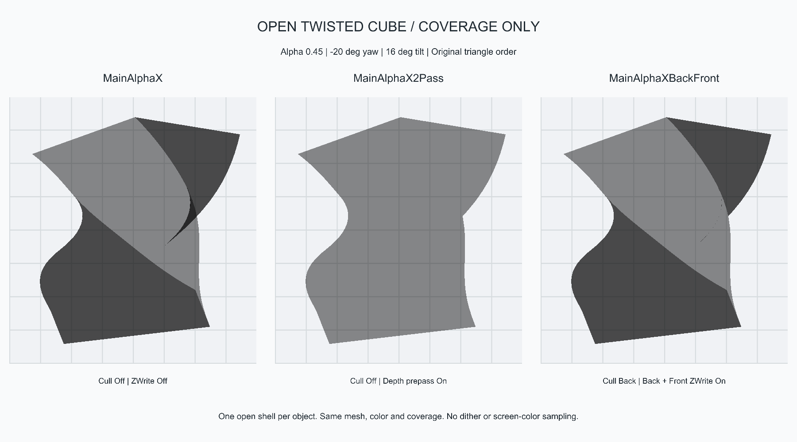
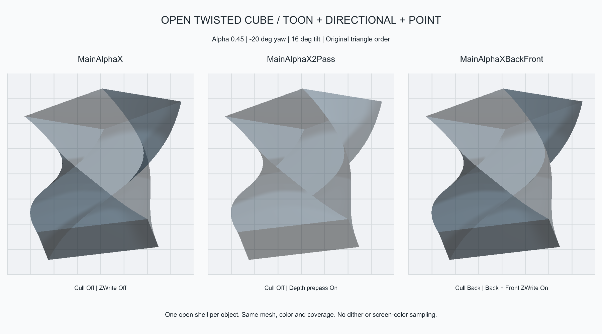
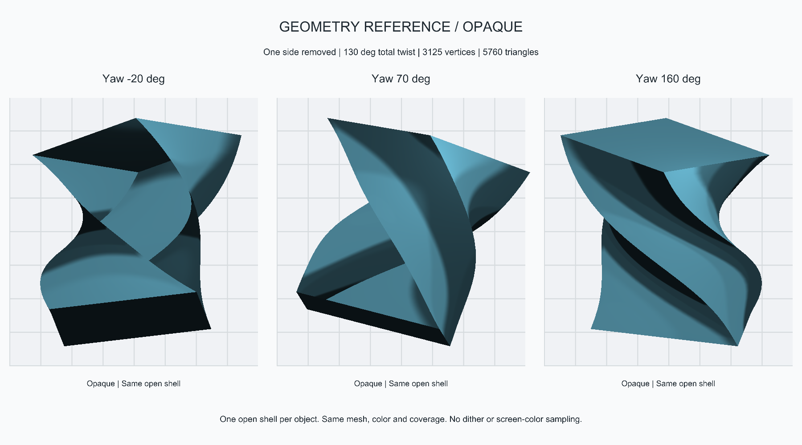

# Twisted Open-Cube Alpha Test

Follow-up: [cross-mesh transparency, queue ordering and depth-write controls](XSeriesCrossMeshAlphaTest.md).

## Setup (2026-10-03)

Unity 2019.4.9f1, Direct3D11, Gamma, Built-in Forward. Rendered with Camera.Render
through CodexBridge, without computer-use capture. No production shader edits.

- Subdivided cube, local -Z side removed, total Y twist 130 degrees, tapered waist.
- 3125 vertices, 5760 triangles; one mesh, one submesh and one renderer per shader.
- Same mesh reference, RGB and Alpha=0.45 on all three objects; no duplicate inner shell.
- MainAlphaX: Cull Off, ZWrite off.
- MainAlphaX2Pass: Cull Off, nearest-surface prepass enabled.
- MainAlphaXBackFront: Cull Back, complementary back and main front depth writes on.
- Global cutoff off; depth/shadow cutoff 0.01; straight output; queue 3000.
- No cast shadows, Outline, Rim, MatCap or probes, to isolate transparent overlap.
- Coverage-only views use the shared emission debug layer. Lit views use the
  normal X material pipeline, directional light and an identical masked point
  light for each object. Background grids and camera framing are identical.

## Captures and Observation

The depth-prepass variant removes most rear-layer accumulation by design.
Standard Alpha and BackFront both darken overlapping dark surfaces. Their flat
color agreement is not proof of correct sorting: identical surface RGB can hide
ordering errors. In the lit view, different surface normals expose that difference.

The test also reverses triangle submission order without reversing winding or
changing geometry, normals, camera, material or lights. In the open-view object
regions, sampled every two pixels (81125 samples per column):

| Lit variant | Mean RGB difference (0..1) | Samples with any channel change > 3/255 |
| --- | --- | --- |
| MainAlphaX | 0.006984 | 16543 |
| MainAlphaX2Pass | 0 | 0 |
| MainAlphaXBackFront | 0.000535 | 266 |

BackFront is more order-stable than standard Alpha in this fixture, but NOT
order-independent. Small jagged boundary differences remain; even its flat
coverage view changes at 257 sampled pixels when triangle order is reversed.
These are unresolved edge/ordering observations, not a passed general-transparency
gate. The mesh has projected self-overlap; it is not an arbitrary intersecting
cloth simulation. Skinned/folded production meshes and post-processing still need testing.

Seven final 1800x1000 captures have finite RGB output. Includes open and side
views, flat and lit modes, reversed-order views and an opaque geometry reference.

## Reproduce

Saved scene and supporting native assets, created and saved by Unity:

`Tests/ReferenceAssets/TwistedAlpha-20261002-161732-800/TwistedAlphaComparison.unity`

Open the scene for the lit three-column comparison. Coverage materials are in
its adjacent Materials folder. No AssetBundle assignment was added to test assets.
The user's previously open scene was restored after rendering, not replaced.

- Bridge `renderxtwistedalpha` creates a fresh, independently named test set.
- Bridge `retakextwistedalpha` with assetPath set to the saved scene regenerates
  the seven diagnostic views. Close that scene before automated rendering.
- `Tests/Measure-XTwistedAlphaOrder.ps1 -ReportDirectory <capture directory>`
  computes order-sensitivity metrics on the image regions, excluding captions.

Final capture directory under the Unity project:
`CodexBridge/Reports/TwistedAlpha-20261002-162452-584` (UTC timestamp).
Local test date is October 3. Earlier capture folders are iteration records;
the initial oversized labels were repaired in the saved scene.

[Render metadata](Evidence/TwistedAlpha-20261003.report.json) and
[order-sensitivity measurements](Evidence/TwistedAlpha-20261003-order.json).
