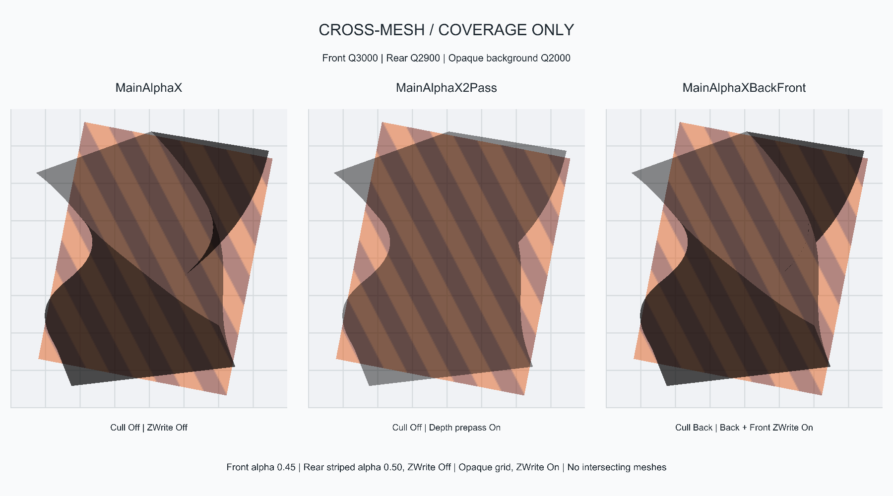
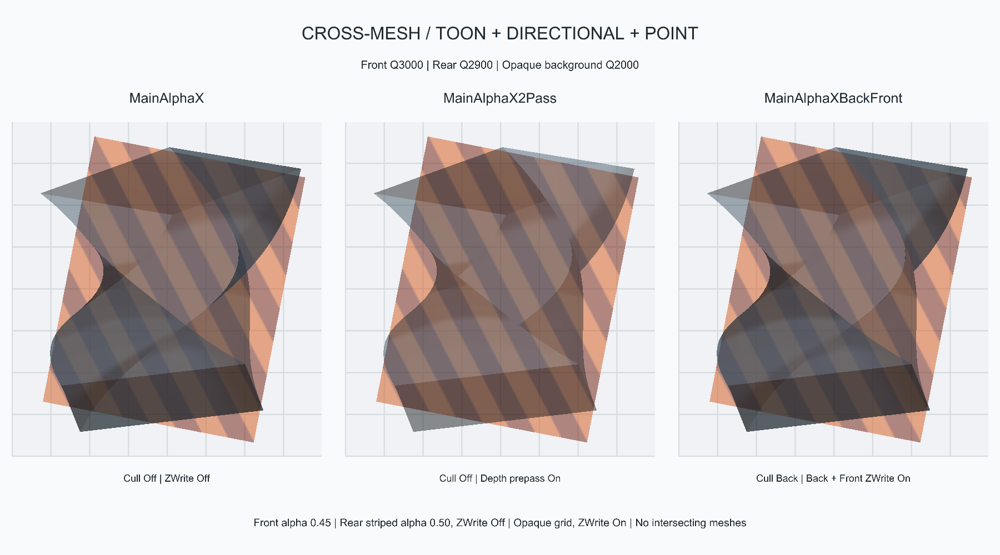
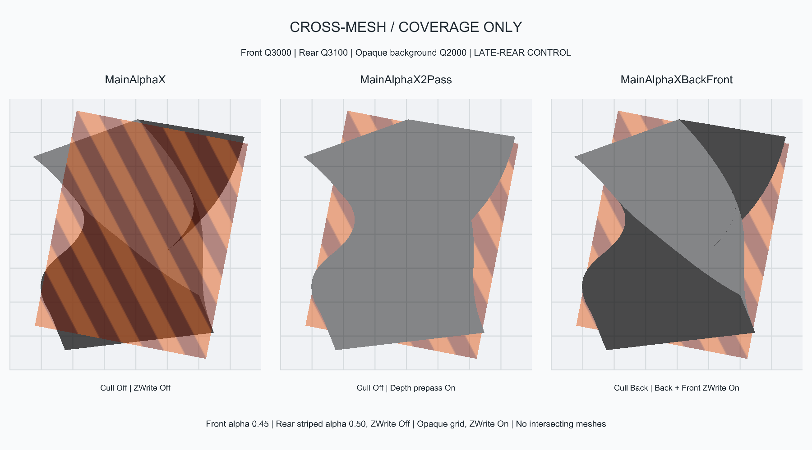
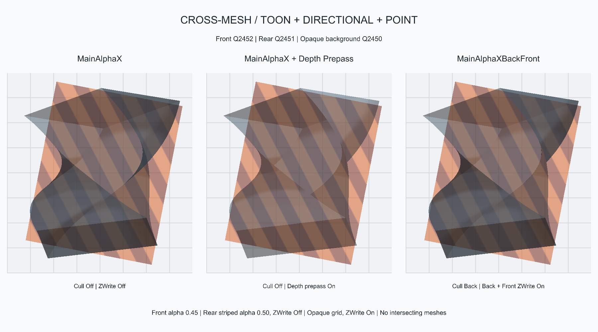

# Cross-Mesh Alpha Compositing (2026-10-03)

Unity 2019.4.9f1 / Direct3D11 / Gamma, rendered through CodexBridge Camera.Render.
This extends the twisted open-cube test without changing production shaders or
the original test scene/materials. All three meshes are physically separated.

## Setup

| Layer | Geometry / shader | Queue | Alpha | Depth write |
| --- | --- | --- | --- | --- |
| Foreground | Twisted open cube / three X Alpha variants | 3000 | 0.45 | Off / prepass On / back and front On |
| Rear | Separate striped Quad / ordinary MainAlphaX | 2900 | 0.50 | Off |
| Background | Farther grid Quad / opaque Unlit/Texture | 2000 | 1 | On |

Camera looks along +Z from z=-8. Foreground is centered at z=0, the rear card
is at z=2.2, and the opaque background is at z=4. The rotated foreground's
bounds stay in front of the rear card. All three columns have the same camera
projection, core material settings and individually masked point-light placement.
There is no dither, screen-color sampling, outline, probe reflection or cast shadow.

## Captures

At the requested queue order, all three foreground strategies composite over
the rear-alpha/background result. Front depth writes do not erase previously
drawn framebuffer color. Depth2Pass still removes rear layers of the foreground
mesh itself; it does not remove the already-rendered, separate rear object.
BackFront retains overlapping front-mesh coverage and further attenuates the
rear stripes in those regions.

## Incorrect-Order Control

Only for this control, the physically rear card is moved to queue 3100. Standard
Alpha does not write foreground depth, so the rear card composites on top of
the foreground color in the wrong order. Depth2Pass and BackFront instead reject
the later rear card wherever the front has written qualifying depth. Neither
outcome is correct transparent transmission through the front surface.

The saved scene resets the rear queue to 2900. The control does not imply that
manually fixing queue order solves intersecting meshes, camera-dependent cycles,
or arbitrary triangle ordering within a single renderer.

## Pixel Verification

Ten checks passed; all 17 captures have finite RGB output. Both flat coverage
and Toon lighting are tested. The foreground is rendered over black and white
to measure its effective transmittance at each pixel, without assuming that
its self-overlap is a correctly sorted physical stack:

`expected = frontOverBlack + (frontOverWhite - frontOverBlack) * rearOverBackground`

All three variants match this over-compositing reference in the object regions;
the largest RGB error is 8.94e-8 (floating-point output, not clamped PNG).
Zero-alpha and globally clipped foreground also match the rear/background-only
reference, with no hidden depth occlusion. These are scoped cross-renderer
checks, not a general transparency, shadow, DOF or performance acceptance gate.

## Reproduce

Scene and new native test materials were created by Unity. No test AssetBundle
bindings were added, and the previously active user scene was restored:

`Tests/ReferenceAssets/CrossMeshAlpha-20261002-170238-558/CrossMeshAlphaComparison.unity`

The scene reuses the original twisted mesh and grid texture as read-only assets.
The striped texture, all foreground/rear materials and background material belong
to the new test folder. Open the scene to see the correct-order Toon comparison.

Bridge operation `renderxcrossmeshalpha` takes the original generated twisted
comparison scene's path in `assetPath`, creates a fresh test folder, renders the
controls, saves the new scene and restores the calling scene. The source scene
must be closed during the automated run.

Full local captures: `CodexBridge/Reports/CrossMeshAlpha-20261002-170238-558`
under the Unity project. Folder stamps use UTC; the local date is October 3.
[Settings and checks](Evidence/CrossMeshAlpha-20261003.report.json).

## Low-Queue Retest: 2450 / 2451 / 2452

Repeated the same fixture with only the queue profile changed:

| Layer | Original queue | Retest queue |
| --- | --- | --- |
| Opaque background | 2000 | 2450 |
| Rear ordinary alpha | 2900 | 2451 |
| Foreground self-overlapping alpha | 3000 | 2452 |
| Deliberately late rear (control only) | 3100 | 2453 |

Geometry, camera, light placement, alpha, blend factors and depth-write settings
are unchanged. The saved scene restores the rear queue to 2451.

All 17 captures rendered successfully and all ten compositing checks passed;
maximum RGB reference error remained 8.94e-8. The object/grid region of each of
the five primary/control PNGs is byte-identical to the original queue profile.
The comparison covers 1,087,200 pixels per image, excluding changed captions.
[Queue comparison results](Evidence/CrossMeshAlpha2450-20261003-queue-comparison.json)
were generated by `Tests/Compare-XCrossMeshQueues.ps1`.

This is a color-compositing result, not camera-depth-texture acceptance. Neither
run requests a camera depth texture or enables DOF/SSAO, and test material
shadow casting is disabled. Unity's Built-in camera depth-texture path only
includes queues at or below 2500 and also depends on a usable ShadowCaster
pass; this is distinct from ordinary framebuffer ZWrite/ZTest. Lowering queues
alone does not establish that the required camera depth is present.
See [Unity 2019.4 camera depth textures](https://docs.unity3d.com/2019.4/Documentation/Manual/SL-CameraDepthTexture.html).

Low-queue scene, created separately through Unity:

`Tests/ReferenceAssets/CrossMeshAlpha2450-20261002-171122-464/CrossMeshAlphaComparison.unity`

Bridge operation `renderxcrossmeshalpha2450` uses the same source-scene input as
`renderxcrossmeshalpha`. Full captures are under the Unity project at
`CodexBridge/Reports/CrossMeshAlpha2450-20261002-171122-464`.
[Retest settings and checks](Evidence/CrossMeshAlpha2450-20261003.report.json).

## Merged Alpha Prepass Regression (2026-10-03)

After consolidating the primary Alpha entries, repeated the low-queue fixture
with the center column changed from legacy MainAlphaX2Pass to MainAlphaX with
DepthPrepass=1 and AlphaOptionZWrite=0. All other settings are unchanged.
All ten checks passed; the same five primary/control image object regions are
byte-identical to the low-queue reference, excluding changed captions.

Scene: `Tests/ReferenceAssets/CrossMeshAlphaMerged-20261002-175256-402/CrossMeshAlphaComparison.unity`.
Bridge operation: `renderxcrossmeshalphamerged`, with the original twisted scene
as `assetPath`. Full captures:
`CodexBridge/Reports/CrossMeshAlphaMerged-20261002-175256-402`.
[Report](Evidence/AlphaMerge-20261003-crossmesh.report.json) and
[region hashes](Evidence/AlphaMerge-20261003-crossmesh-images.json).
The same camera-depth/post-processing limitations apply; this tests color
composition and framebuffer depth behavior, not the camera depth texture.
