# Tom Shaders X

**English** | [简体中文](README.zh-CN.md)

Toon-first shaders for Koikatsu Sunshine and Unity 2019.4 Built-in Forward.

**[Interactive showcase](https://tomtom1010-iee.github.io/TomshadersX/)** ·
[User manual](https://tomtom1010-iee.github.io/TomshadersX/UserManual.html) ·
[Source and build guide](Documents/Development.md)

96 actual Unity GPU renders, in 24 comparisons. Every subject uses the same
standard UV sphere and fixed exposure. No per-image brightening or generated
illustrations. Open the interactive showcase for full-resolution images and complete
material settings.

Nine shaders cover opaque/cutout surfaces, three transparency strategies, hair,
eye-area surfaces, iris optics, shared face/body skin, and an independent liquid overlay. Common features include
Toon diffuse and highlights, GGX, shadow styling, SH diffuse, environment
reflection, MatCap, Clearcoat, Rim, Outline and emission. Hair adds anisotropy;
EyeX adds shader-only shallow parallax, depth maps and optional RGB dispersion.

## Use and Scope

- **[Download the complete KKS package](https://github.com/tomTom1010-IEE/TomshadersX/releases/tag/v0.3.1-20261011)**
  (2026-10-11 revision). Includes both zipmods, optional plugins and required bundles.
  [Release notes and upgrade instructions](Documents/ReleaseNotes.en.md).
- This revision adds HairX three-color masks, the modern liquid layer and LiquidX,
  Toon normal controls, and **ToonMinLighting = 0.15** by default. Saved overrides
  remain unchanged; materials without a saved minimum inherit the new default.

- Current package: **0.3.1**, with new indirect diffuse gain defaulting to **0.25**.
  Saved material overrides are preserved.
- Use Sideloader and MaterialEditor with the built zipmod in the game's mods
  directory. This repository contains the source package, not a complete Unity
  project; see the build guide to produce a zipmod.
- Ordinary shading, Clearcoat and EyeX optics do not need extra plugins.
  HairFront feathering and Studio lighting-probe items use separate optional
  providers described in the manual.
- The showcase is a visual reference, not a set of forced character presets.
  It does not claim in-game GPU performance or universal mesh compatibility.

SH examples use known coefficients to isolate directional diffuse, not captured
Studio GI. Transparency uses a checker background; shadow tests use a shadow-only
occluder. Eye comparisons document their viewing angles and include same-angle
on/off controls. Dispersion is a geometric RGB approximation, not wave optics.

## Diffuse and Toon Shading

[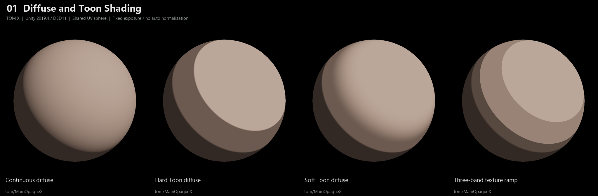](https://tomtom1010-iee.github.io/TomshadersX/#01-diffuse)

## Cast Shadows and Toon Shadow Response

[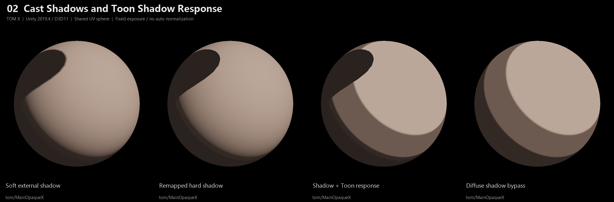](https://tomtom1010-iee.github.io/TomshadersX/#02-shadow)

## GGX and Toon Highlights

[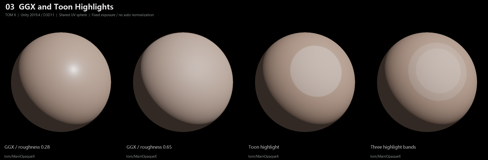](https://tomtom1010-iee.github.io/TomshadersX/#03-specular)

## Metallic and Roughness

[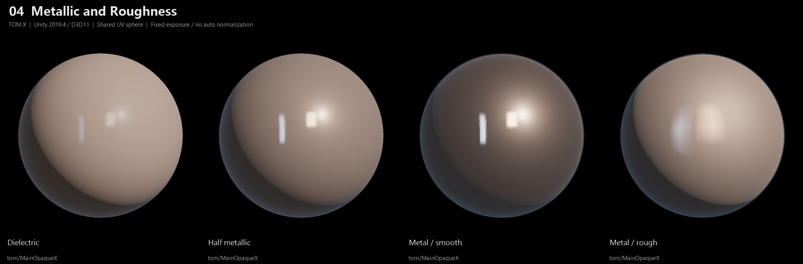](https://tomtom1010-iee.github.io/TomshadersX/#04-material)

## Directional SH Diffuse

[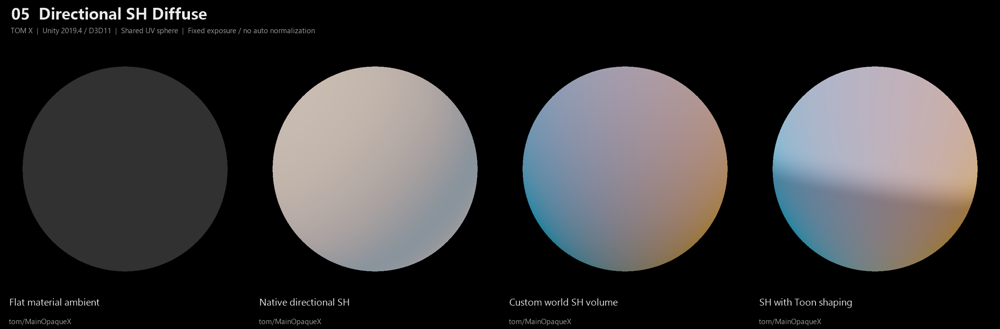](https://tomtom1010-iee.github.io/TomshadersX/#05-sh)

## Environment Reflection and Stylization

[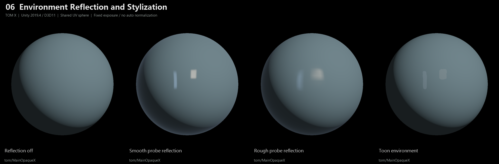](https://tomtom1010-iee.github.io/TomshadersX/#06-environment)

## MatCap Combinations

[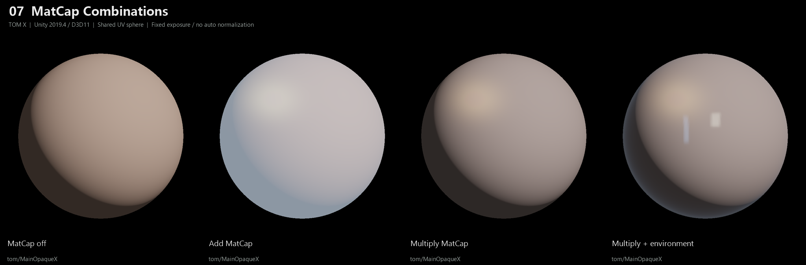](https://tomtom1010-iee.github.io/TomshadersX/#07-matcap)

## Independent Clearcoat Surface Layer

[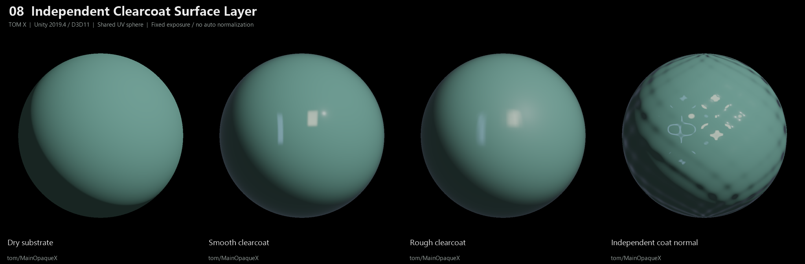](https://tomtom1010-iee.github.io/TomshadersX/#08-clearcoat)

## Rim, Outline and Emission

[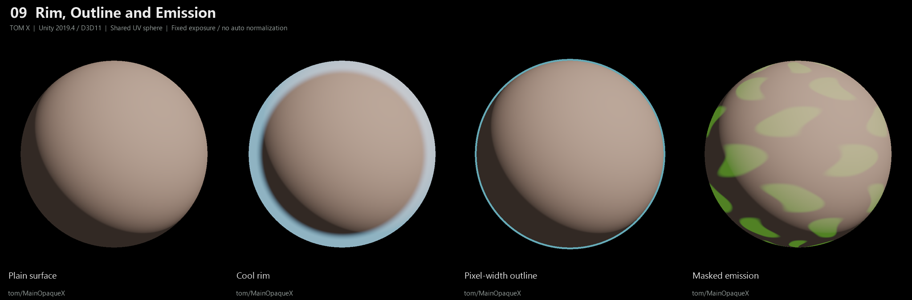](https://tomtom1010-iee.github.io/TomshadersX/#09-art-layers)

## Main, Detail and Coat Normals

[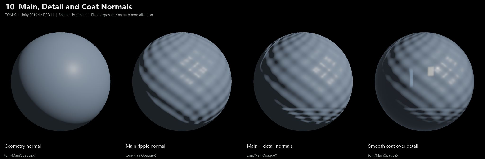](https://tomtom1010-iee.github.io/TomshadersX/#10-normals)

## ForwardAdd Multi-Light Response

[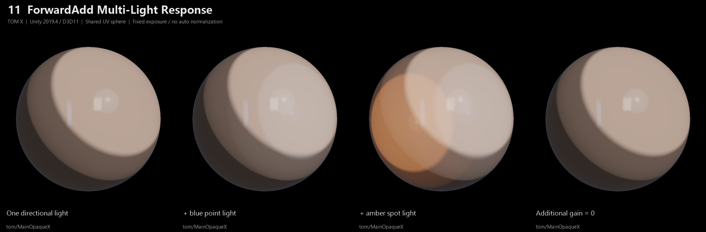](https://tomtom1010-iee.github.io/TomshadersX/#11-multilight)

## Anisotropy and Flow Direction

[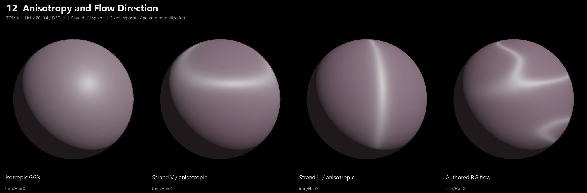](https://tomtom1010-iee.github.io/TomshadersX/#12-anisotropy)

## Hair Toon Highlights

[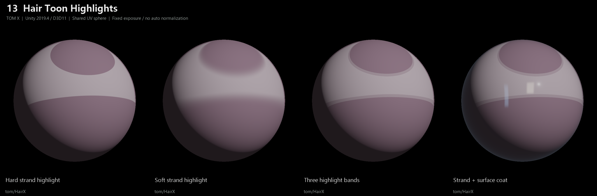](https://tomtom1010-iee.github.io/TomshadersX/#13-hair-toon)

## Skin Softening, Warmth and Wetness

[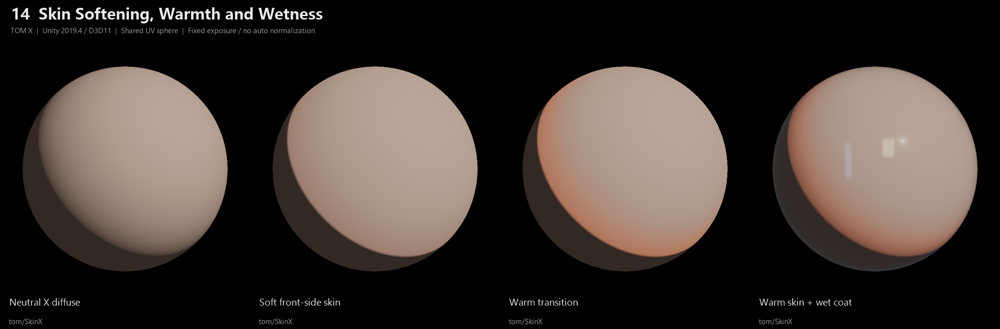](https://tomtom1010-iee.github.io/TomshadersX/#14-skin)

## Skin Masks and Liquid Layers

[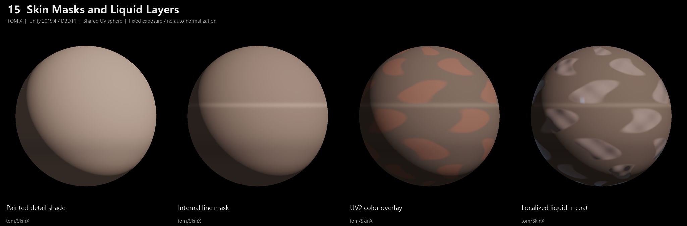](https://tomtom1010-iee.github.io/TomshadersX/#15-skin-art)

## EyeWX Surface and Tint

[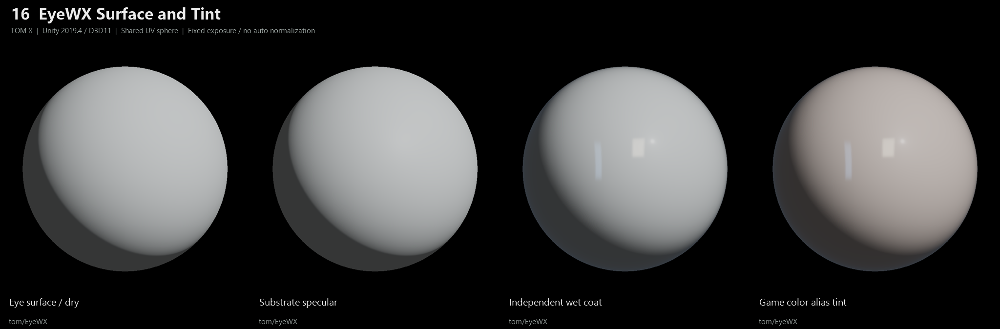](https://tomtom1010-iee.github.io/TomshadersX/#16-eyew)

## Flat Floor, Shallow Cone and Bowl

[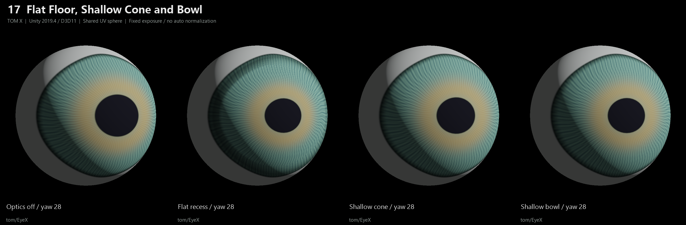](https://tomtom1010-iee.github.io/TomshadersX/#17-eye-shapes)

## Painted Depth at Different Angles

[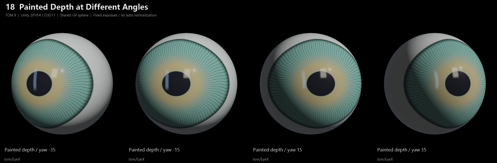](https://tomtom1010-iee.github.io/TomshadersX/#18-eye-angles)

## Local Refraction and RGB Dispersion

[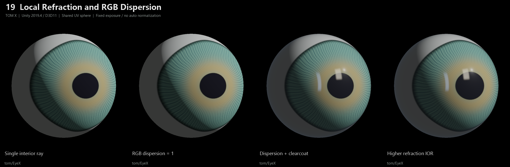](https://tomtom1010-iee.github.io/TomshadersX/#19-eye-dispersion)

## Independent Coat and Refraction IOR

[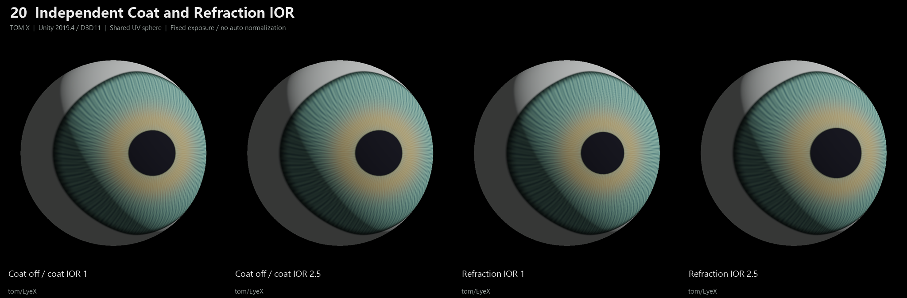](https://tomtom1010-iee.github.io/TomshadersX/#20-ior-isolation)

## Same-Angle Optics On/Off Controls

[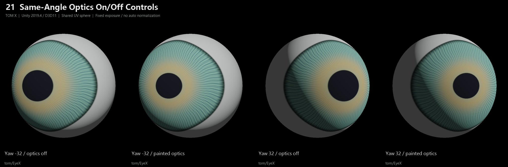](https://tomtom1010-iee.github.io/TomshadersX/#21-eye-angle-controls)

## Alpha Coverage and Drawing Strategies

[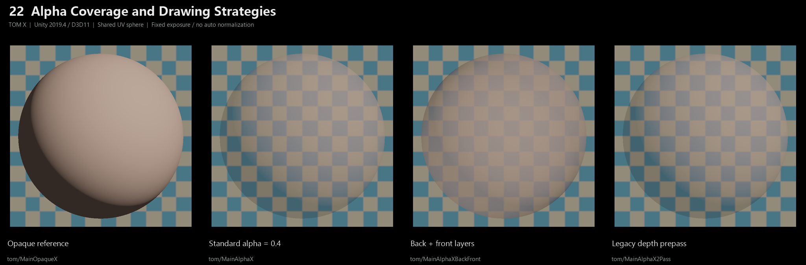](https://tomtom1010-iee.github.io/TomshadersX/#22-transparency)

## Inward Stencil Feathering

[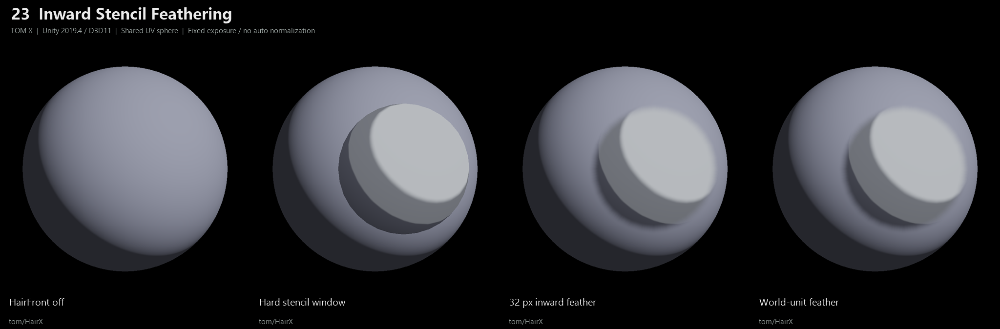](https://tomtom1010-iee.github.io/TomshadersX/#23-hairfront)

## Combined Material Styles

[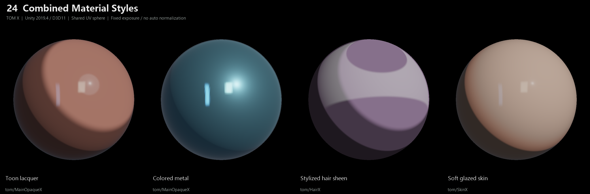](https://tomtom1010-iee.github.io/TomshadersX/#24-finished-materials)

## Development and License

Read the [development guide](Documents/Development.md), the
[English manual](Documents/TomShadersX-UserManual.en.md), or the
[Chinese manual](Documents/TomShadersX-UserManual.zh-CN.md).

The project is published under [AGPL-3.0](LICENSE). The original MIT upstream
copyright and permission notices are preserved in
[LICENSES/MIT-Upstream.txt](LICENSES/MIT-Upstream.txt) and documented in
[THIRD_PARTY_NOTICES.md](THIRD_PARTY_NOTICES.md).
