# Tom Shaders X

[English](README.md) | **简体中文**

面向 Koikatsu Sunshine 与 Unity 2019.4 Built-in Forward 的 Toon 风格优先着色器系列。

**[交互式展示](https://tomtom1010-iee.github.io/TomshadersX/Gallery.zh-CN.html)** ·
[用户手册](https://tomtom1010-iee.github.io/TomshadersX/UserManual.zh-CN.html) ·
[源码与构建指南](Documents/Development.md)

96 张实际 Unity GPU 渲染，24 组对照。所有材质使用同一标准 UV 球网格与固定曝光，
没有逐图提亮，也没有生成式示意图。打开交互式展示可查看原尺寸图片和完整材质参数。

九款着色器覆盖不透明与裁切表面、三种透明策略、头发、眼周表面、瞳孔光学、脸部与身体共用皮肤，以及独立液体覆盖层。
共同功能包括 Toon 漫反射与高光、GGX、阴影风格化、SH 漫射、环境反射、MatCap、Clearcoat、
Rim、描边与发光。HairX 提供各向异性；EyeX 提供无需额外网格的浅层视差、深度图和可选 RGB 色散。

## 使用与范围

- **[下载 KKS 完整发布包](https://github.com/tomTom1010-IEE/TomshadersX/releases/tag/v0.3.1-20261011)**
  （2026-10-11 修订版），包含两个 zipmod、可选插件及所需资源包。
  [发布说明与升级指引](Documents/ReleaseNotes.zh-CN.md)。
- 本次加入 HairX 三色蒙版、现代液体层与 LiquidX、Toon 法线控制，以及默认
  **0.15** 的 ToonMinLighting。已保存的覆盖值不变；未保存此参数的材质继承新默认值。

- 当前版本：**0.3.1**，新材质的间接漫射增益默认为 **0.25**，保留已有材质保存的覆盖值。
- 配合 Sideloader 与 MaterialEditor，将构建后的 zipmod 放入游戏 mods 目录。本仓库为源码包，
  不是完整 Unity 工程；生成 zipmod 的方法见构建指南。
- 常规着色、Clearcoat 与 EyeX 光学不需要额外插件。HairFront 羽化与工作室光照探针物品
  使用独立的可选配套插件，详见用户手册。
- 展示是视觉参考，不是强制角色预设，也不代表游戏内 GPU 性能或对所有网格的兼容性承诺。

SH 组使用已知系数隔离方向性漫射，不代表工作室捕捉的 GI。透明组使用棋盘背景；阴影组使用仅投影遮挡体。
眼睛组标明观察角度，并提供同角度光学开关对照。色散是几何 RGB 近似，不是波动光学仿真。

## 漫反射与 Toon 明暗

[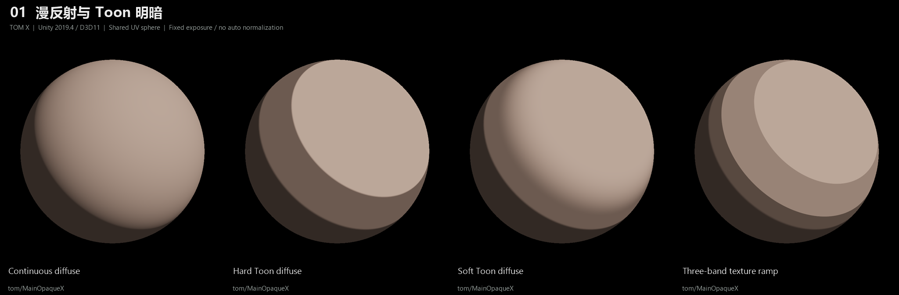](https://tomtom1010-iee.github.io/TomshadersX/Gallery.zh-CN.html#01-diffuse)

## 实际投影与 Toon 阴影

[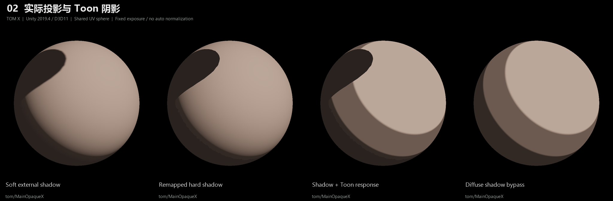](https://tomtom1010-iee.github.io/TomshadersX/Gallery.zh-CN.html#02-shadow)

## GGX 与 Toon 高光

[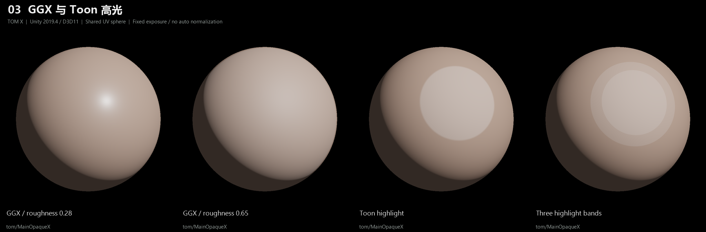](https://tomtom1010-iee.github.io/TomshadersX/Gallery.zh-CN.html#03-specular)

## 金属度与粗糙度

[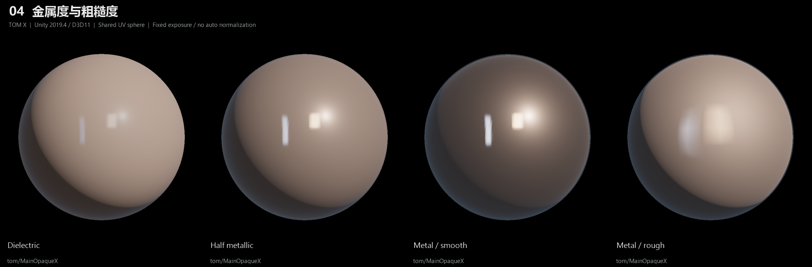](https://tomtom1010-iee.github.io/TomshadersX/Gallery.zh-CN.html#04-material)

## SH 方向性漫射

[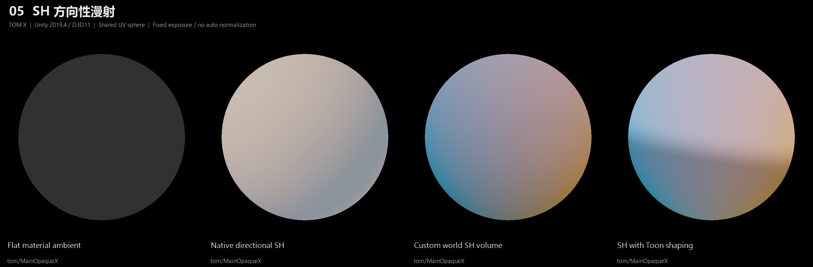](https://tomtom1010-iee.github.io/TomshadersX/Gallery.zh-CN.html#05-sh)

## 环境反射与风格化

[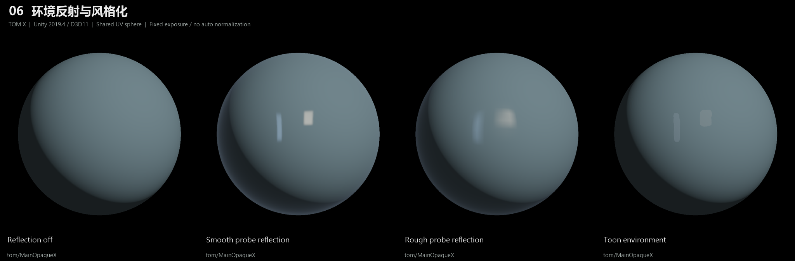](https://tomtom1010-iee.github.io/TomshadersX/Gallery.zh-CN.html#06-environment)

## MatCap 组合

[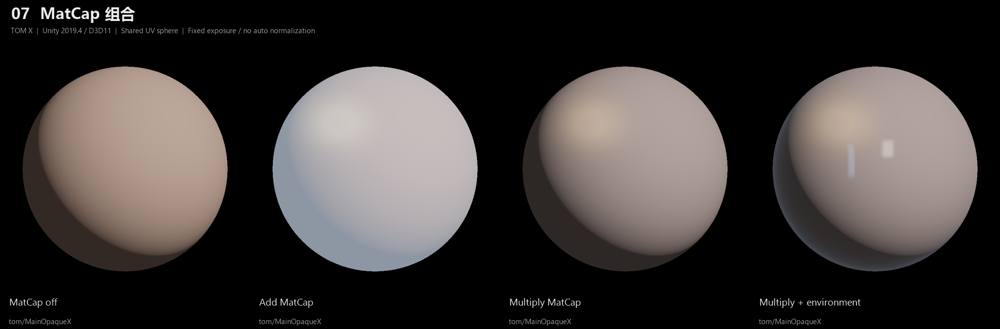](https://tomtom1010-iee.github.io/TomshadersX/Gallery.zh-CN.html#07-matcap)

## 独立 Clearcoat 表面层

[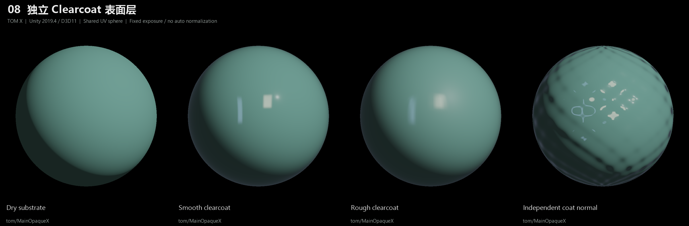](https://tomtom1010-iee.github.io/TomshadersX/Gallery.zh-CN.html#08-clearcoat)

## Rim、描边与发光

[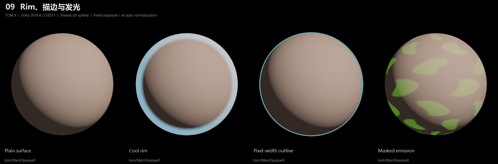](https://tomtom1010-iee.github.io/TomshadersX/Gallery.zh-CN.html#09-art-layers)

## 主法线、细节与涂层法线

[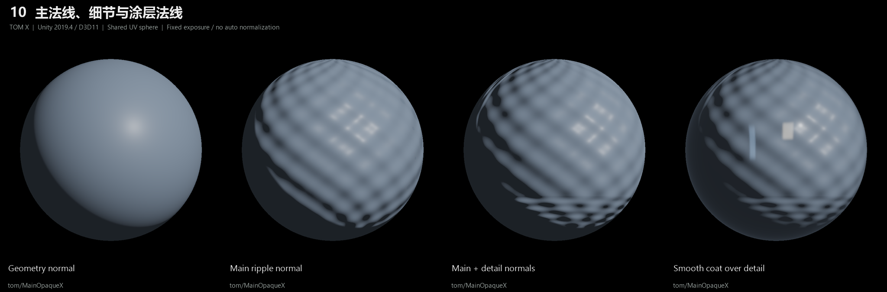](https://tomtom1010-iee.github.io/TomshadersX/Gallery.zh-CN.html#10-normals)

## ForwardAdd 多灯响应

[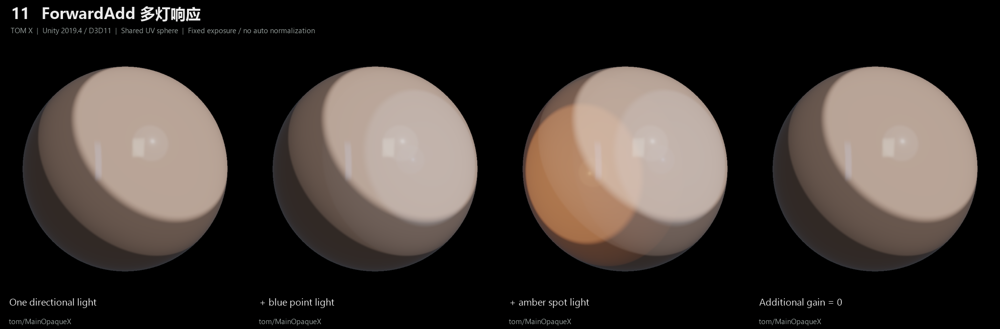](https://tomtom1010-iee.github.io/TomshadersX/Gallery.zh-CN.html#11-multilight)

## 各向异性与流向图

[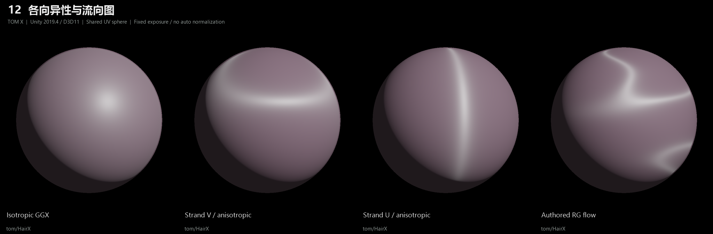](https://tomtom1010-iee.github.io/TomshadersX/Gallery.zh-CN.html#12-anisotropy)

## 头发 Toon 高光

[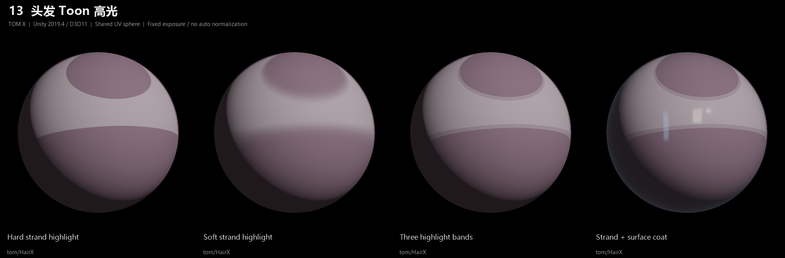](https://tomtom1010-iee.github.io/TomshadersX/Gallery.zh-CN.html#13-hair-toon)

## 皮肤柔化、暖色与湿润

[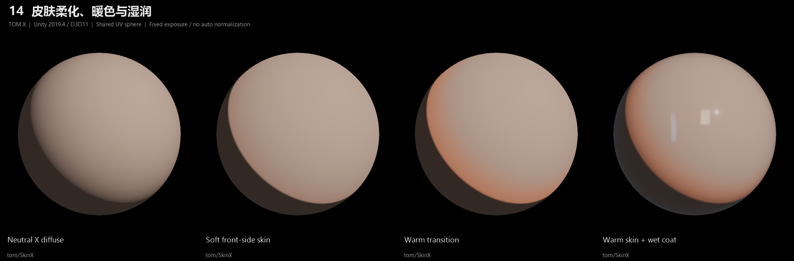](https://tomtom1010-iee.github.io/TomshadersX/Gallery.zh-CN.html#14-skin)

## 皮肤标准遮罩与液体

[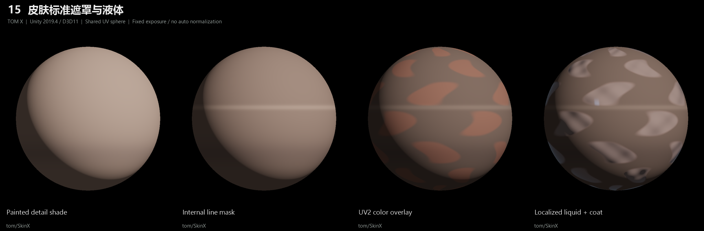](https://tomtom1010-iee.github.io/TomshadersX/Gallery.zh-CN.html#15-skin-art)

## EyeWX 眼表与调色

[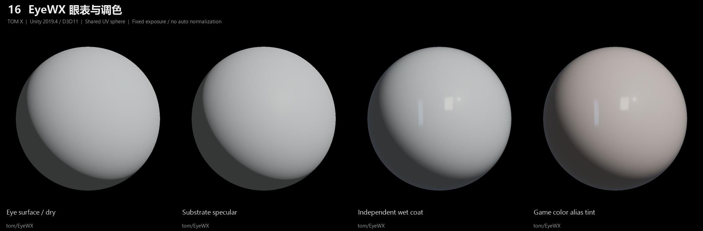](https://tomtom1010-iee.github.io/TomshadersX/Gallery.zh-CN.html#16-eyew)

## 平底、浅锥和浅碗

[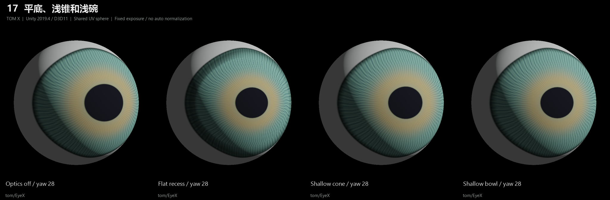](https://tomtom1010-iee.github.io/TomshadersX/Gallery.zh-CN.html#17-eye-shapes)

## 自绘深度的多角度效果

[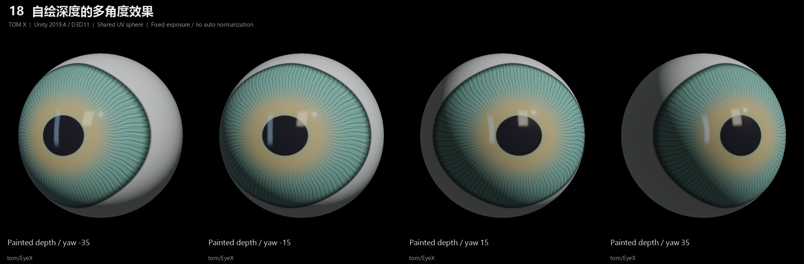](https://tomtom1010-iee.github.io/TomshadersX/Gallery.zh-CN.html#18-eye-angles)

## 局部折射与 RGB 色散

[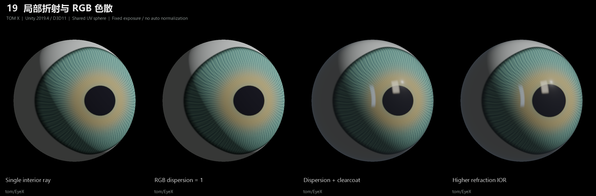](https://tomtom1010-iee.github.io/TomshadersX/Gallery.zh-CN.html#19-eye-dispersion)

## 涂层 IOR 与折射 IOR 分离

[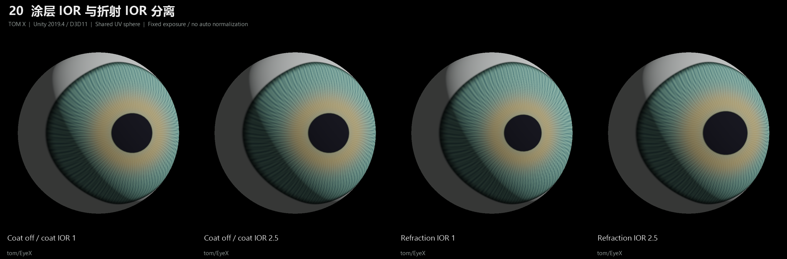](https://tomtom1010-iee.github.io/TomshadersX/Gallery.zh-CN.html#20-ior-isolation)

## 同角度光学开关对照

[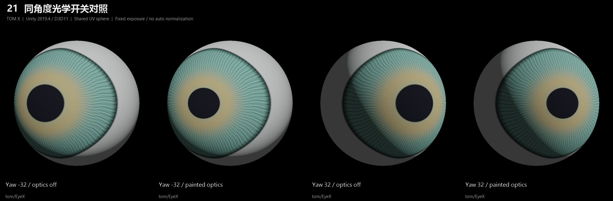](https://tomtom1010-iee.github.io/TomshadersX/Gallery.zh-CN.html#21-eye-angle-controls)

## 透明覆盖与绘制策略

[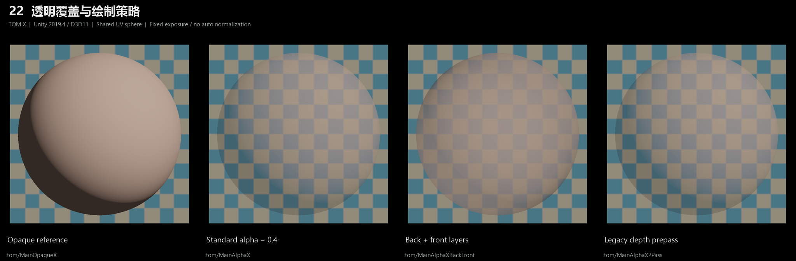](https://tomtom1010-iee.github.io/TomshadersX/Gallery.zh-CN.html#22-transparency)

## Stencil 内侧羽化

[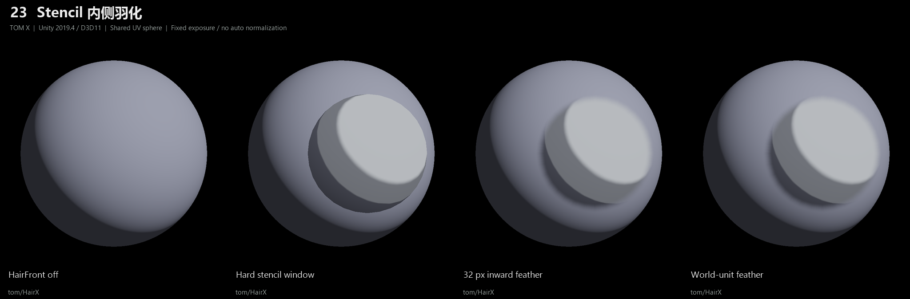](https://tomtom1010-iee.github.io/TomshadersX/Gallery.zh-CN.html#23-hairfront)

## 组合风格材质

[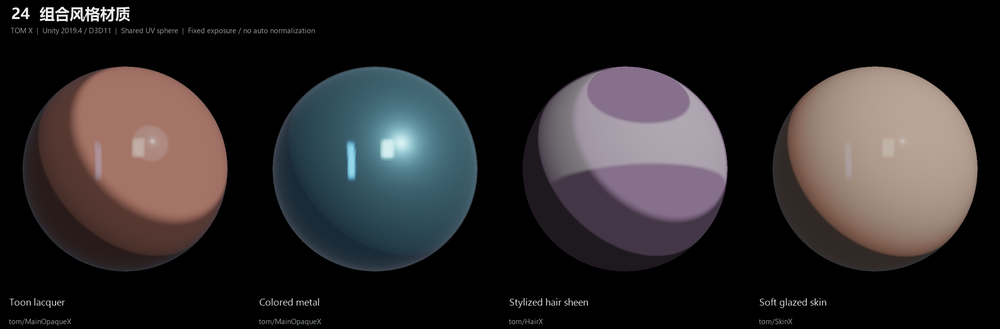](https://tomtom1010-iee.github.io/TomshadersX/Gallery.zh-CN.html#24-finished-materials)

## 开发与许可

参阅[开发指南](Documents/Development.md)与[用户手册](Documents/TomShadersX-UserManual.zh-CN.md)。

本项目采用 [AGPL-3.0](LICENSE)。原始 MIT 上游版权与许可声明保留于
[LICENSES/MIT-Upstream.txt](LICENSES/MIT-Upstream.txt)，详见
[THIRD_PARTY_NOTICES.md](THIRD_PARTY_NOTICES.md)。
